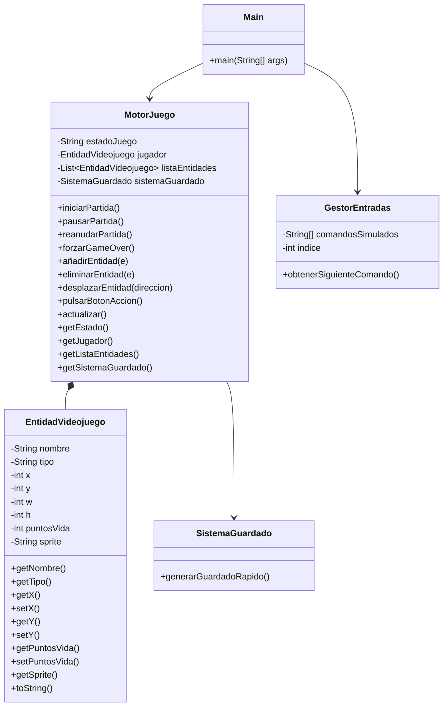
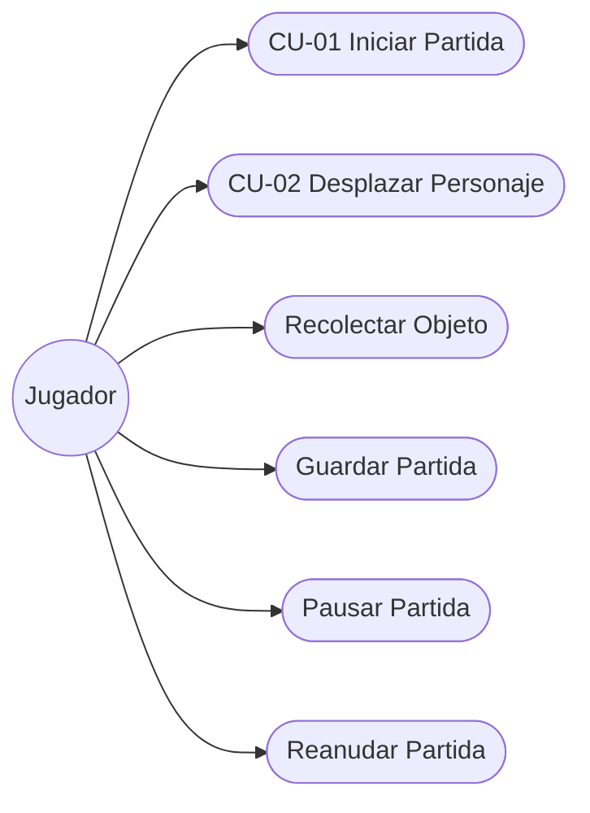

# Motor de Videojuego 2D - Simulación de Motor de Juego

## 1. Temática Elegida

Este proyecto simula el funcionamiento básico de un motor de videojuego 2D. El sistema permite gestionar el ciclo de vida de una partida mediante distintos estados (menú, juego, pausa y game over), controlar el movimiento del jugador sobre un mapa, interactuar con objetos del entorno, detectar colisiones con enemigos y realizar guardados rápidos del estado actual de la partida.

La simulación se ejecuta mediante una secuencia de entradas predefinidas que representan las acciones que realizaría un jugador durante una sesión de juego.

---

# 2. Arquitectura del Software

La aplicación sigue una arquitectura orientada a objetos basada en la separación de responsabilidades.

## Main

Clase principal encargada de iniciar la aplicación.

Responsabilidades:

* Crear las instancias principales del sistema.
* Inicializar el motor de juego.
* Gestionar el bucle principal.
* Procesar los comandos recibidos desde el gestor de entradas.

---

## MotorJuego

Es la clase central del sistema.

Responsabilidades:

* Gestionar los estados del juego.
* Controlar la partida.
* Gestionar las entidades existentes.
* Procesar los movimientos del jugador.
* Detectar colisiones.
* Coordinar el sistema de guardado.

Representa el núcleo del motor de juego.

---

## EntidadVideojuego

Representa cualquier objeto existente dentro del mundo del juego.

Responsabilidades:

* Almacenar posición.
* Almacenar puntos de vida.
* Identificar el tipo de entidad.
* Proporcionar acceso controlado a sus atributos.

Puede representar:

* Jugador.
* Enemigo.
* Objeto coleccionable.

---

## GestorEntradas

Simula las entradas del usuario.

Responsabilidades:

* Generar comandos.
* Proporcionar las acciones que ejecutará el jugador.
* Separar la lógica de entrada de la lógica del motor.

---

## SistemaGuardado

Gestiona el guardado rápido de la partida.

Responsabilidades:

* Recopilar el estado actual del juego.
* Generar una representación JSON del guardado.
* Mostrar la información almacenada.

---

# 3. Diagrama de Clases UML



---

# 4. Diagrama de Casos de Uso UML



---

# 5. Especificación de Casos de Uso

## Caso de Uso CU-01 Iniciar Partida

| Campo               | Descripción                                                                                                                                                                                             |
| ------------------- | ------------------------------------------------------------------------------------------------------------------------------------------------------------------------------------------------------- |
| Nombre              | CU-01 Iniciar Partida                                                                                                                                                                                   |
| Objetivo            | Comenzar una nueva sesión de juego.                                                                                                                                                                     |
| Actor Principal     | Jugador                                                                                                                                                                                                 |
| Precondiciones      | La aplicación está ejecutándose y el motor se encuentra en estado MENU.                                                                                                                                 |
| Flujo Principal     | 1. El jugador inicia la partida.<br>2. El sistema cambia el estado a JUGANDO.<br>3. Se crea el jugador.<br>4. Se generan las entidades iniciales del mapa.<br>5. Comienza el bucle principal del juego. |
| Flujos Alternativos | Si ocurre un error al crear las entidades, la partida no se inicia.                                                                                                                                     |
| Postcondiciones     | El juego queda en estado JUGANDO con las entidades inicializadas.                                                                                                                                       |
| Reglas de Negocio   | No puede iniciarse una nueva partida si el sistema ya está ejecutando otra.                                                                                                                             |

---

## Caso de Uso CU-02 Desplazar Personaje

| Campo               | Descripción                                                                                                                                                                                                       |
| ------------------- | ----------------------------------------------------------------------------------------------------------------------------------------------------------------------------------------------------------------- |
| Nombre              | CU-02 Desplazar Personaje                                                                                                                                                                                         |
| Objetivo            | Modificar la posición del jugador dentro del mapa.                                                                                                                                                                |
| Actor Principal     | Jugador                                                                                                                                                                                                           |
| Precondiciones      | La partida debe encontrarse en estado JUGANDO.                                                                                                                                                                    |
| Flujo Principal     | 1. El jugador pulsa una dirección.<br>2. El sistema recibe el comando.<br>3. El motor actualiza las coordenadas del jugador.<br>4. Se ejecuta la actualización del juego.<br>5. Se verifican posibles colisiones. |
| Flujos Alternativos | Si la partida está en PAUSA el movimiento no se procesa.                                                                                                                                                          |
| Postcondiciones     | La posición del jugador queda actualizada.                                                                                                                                                                        |
| Reglas de Negocio   | Solo se permiten desplazamientos cuando el estado del juego es JUGANDO.                                                                                                                                           |

---

# 6. Tecnologías Utilizadas

* Java
* Programación Orientada a Objetos (POO)
* UML mediante Mermaid
* Git
* GitHub
* Gemini
* Chat-GPT


---

# 7. Bitácora del Uso de Inteligencia Artificial

## Herramienta Utilizada y Rol Asignado

Durante el desarrollo de este proyecto se utilizó ChatGPT como asistente de apoyo para:

* Diseño de la arquitectura orientada a objetos.
* Revisión de la estructura de clases.
* Generación de diagramas UML en formato Mermaid.
* Redacción de documentación técnica y README.
* Verificación de buenas prácticas de programación en Java.

La implementación final, validación y adaptación del código fueron realizadas manualmente por el desarrollador.

---

## Muestra de Prompts Utilizados

### Prompt 1

```text
Diseña un motor de videojuego sencillo en Java utilizando Programación Orientada a Objetos. Debe incluir una clase principal, una clase para las entidades del videojuego, un sistema de guardado y un gestor de entradas. Mantén el diseño simple y adecuado para una práctica académica.
```

### Prompt 2

```text
Genera un diagrama UML en Mermaid para un proyecto Java formado por las clases Main, MotorJuego, EntidadVideojuego, SistemaGuardado y GestorEntradas. El diagrama debe mostrar atributos privados, métodos públicos y relaciones entre clases.
```

---

## Control de Errores de la IA

Durante el proceso de diseño, la IA propuso inicialmente una solución excesivamente compleja para los requisitos de la práctica, añadiendo clases adicionales para la gestión de escenas, sistemas de físicas, renderizado y controladores especializados.

Esta propuesta suponía una sobreingeniería innecesaria para los objetivos del proyecto y dificultaba el cumplimiento de los requisitos académicos.

Para corregirlo se indicó explícitamente que:

```text
Reduce la solución al mínimo número de clases posible y ajusta el diseño a una práctica académica sencilla centrada en Programación Orientada a Objetos.
```

Posteriormente se simplificó la arquitectura hasta obtener únicamente las clases necesarias para implementar la funcionalidad requerida.

Además, se revisó manualmente el código generado para verificar nombres de métodos, coherencia de responsabilidades y adecuación a los requisitos del examen.

---

## Reflexión Crítica

El uso de inteligencia artificial durante el desarrollo permitió acelerar considerablemente la fase de diseño y documentación del proyecto. La IA facilitó la generación de ejemplos, diagramas UML y propuestas de organización del código, reduciendo el tiempo necesario para tareas repetitivas.

Sin embargo, también presentó algunos riesgos. En varias ocasiones propuso soluciones más complejas de lo necesario o añadió funcionalidades que no estaban contempladas en los requisitos. Esto demuestra que las respuestas generadas por IA deben ser revisadas críticamente antes de incorporarse al proyecto.

Bajo presión de tiempo, la IA puede ser una herramienta muy útil para aumentar la productividad y servir como apoyo técnico, pero no sustituye la comprensión del problema ni la responsabilidad del desarrollador en la validación del resultado final. El éxito del proyecto depende de combinar la asistencia de la IA con una revisión humana rigurosa.

---

# 8. Autor

Proyecto desarrollado como examen práctico para la asignatura de Entornos de Desarrollo por Jose Pérez Lorente.
